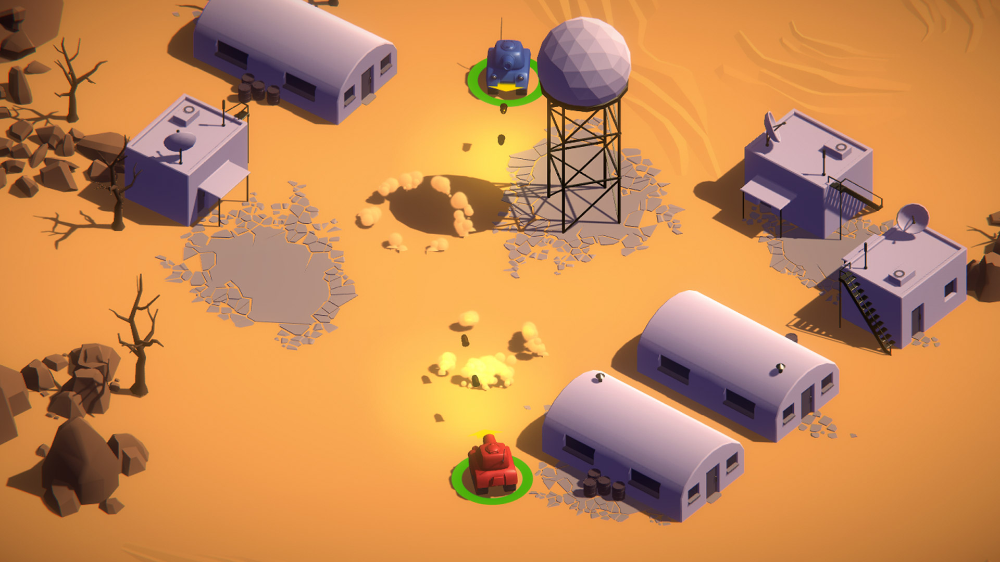

Here is a list of projects that I've done in the past.

# Websites

### YelpCamp

A full-stack website at Heroku using Express.js (Node.js) that can let users register, log
in, and log out. Users can also view, add, edit, and delete campsites, and reviews for campsites.

(Unfortunately, my Heroku account was deleted due to inactivity)

### Store Management System

Built a backend RESTful API to query and manage stores, items, and users based on Flask and Flask-RESTful.
Stored the stores, items, and users data in the SQLite database, and used Flask-SQLAlchemy to build Object–Relational Mapping (ORM) between SQLite records and Python objects.

# Games

### Tanks
 

This is 2 player 1 keyboard (local-multiplayer) couch warfest game.
You can drive a tank to shoot the other player.

### Scavenger

 

A 2D Roguelike game with this project with procedural tile-based levels, turn-based movement, hunger system, and audio and mobile touch controls. In this game, you can avoid enemies, gather food and proceed to the next level.

### Ellen's Adventure

 

A 2D platformer/adventure game built with Unity 2D Game Kit.

Explore the ancient and mysterious alien planet where our Principal Engineer, Ellen has crash landed. Avoid the hazards and defeat the enemies lurking within the ancient ruins of this alien civilization.

### Space Shooter

 

A simple top-down arcade-style shooter using basic assets provided by Unity Technology.

### Procedural Cave Generation

 

A game used to create procedurally generated caverns/dungeons using cellular automata and marching squares.

# Applications

### Computer Vision Application

 

Created a GUI that can display the coordinates and RGB values of the point hovered by the mouse in real time.
Implemented color image processing, binarization, algebra and geometry operations, and contrast adjustment.
CV operations include smoothing filters, edge detection, binary morphology, and grayscale morphology.

